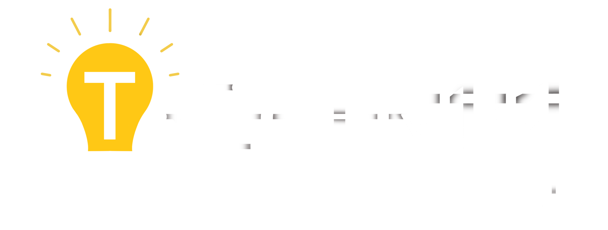
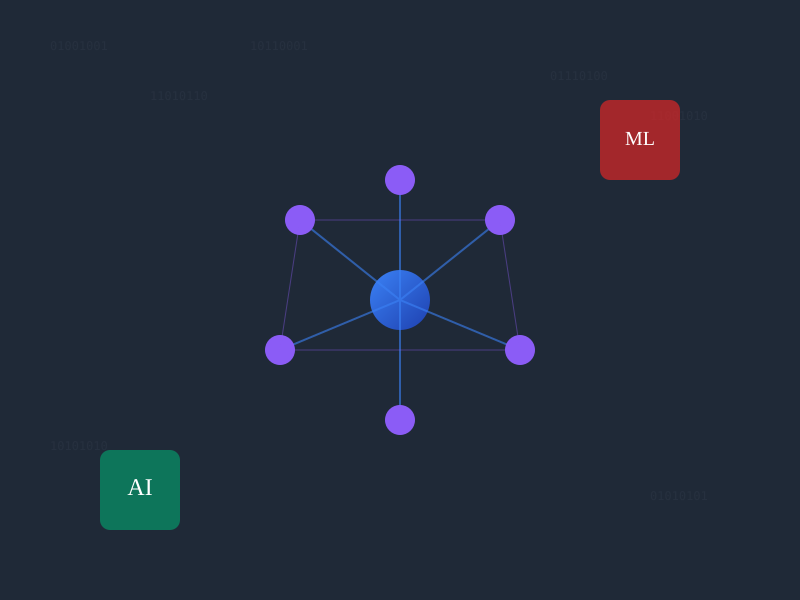
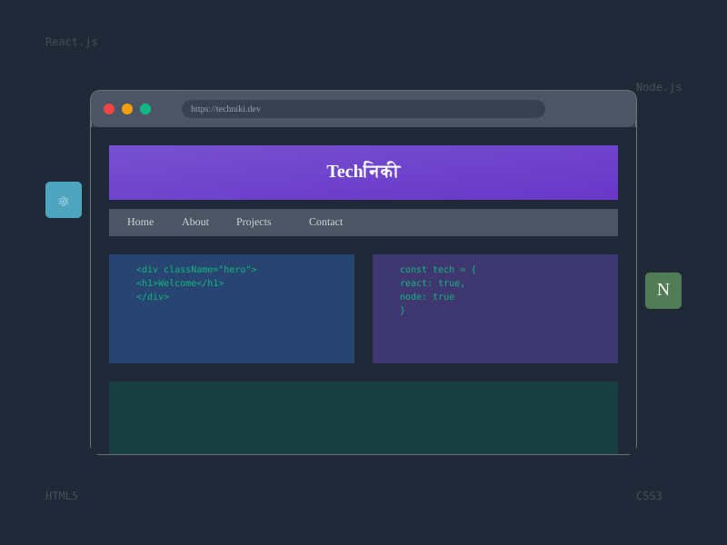
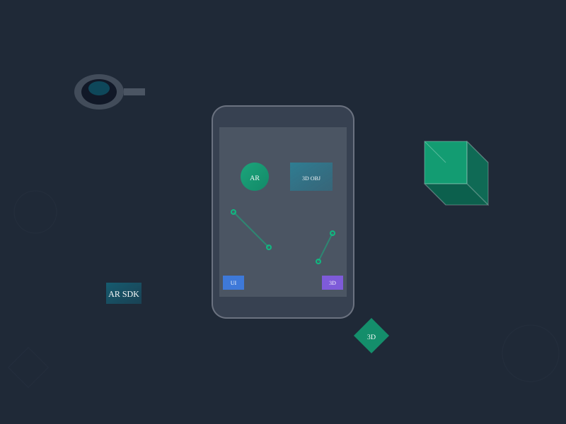
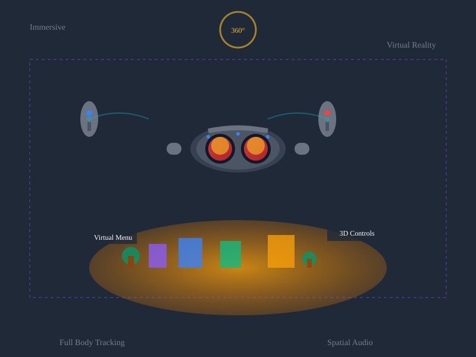

# Project Reorganization Guide

## What Was Changed

The project structure has been reorganized for better maintainability:

### Directory Structure
- ✅ **pages/** - All HTML pages except index.html
- ✅ **assets/css/** - Stylesheets
- ✅ **assets/js/** - JavaScript files  
- ✅ **assets/images/logo/** - Logo files
- ✅ **assets/images/icons/** - SVG icons
- ✅ **assets/images/backgrounds/** - Background images
- ✅ **assets/images/team/** - Team member photos
- ✅ **assets/images/events/** - Event images

### Updated Paths in index.html
- ✅ Logo icon: `assets/images/logo/logo.ico`
- ✅ Logo image: `assets/images/logo/logo.png`
- ✅ Navigation links now point to `pages/*.html`

### Files That Need Path Updates

When working on other pages, update these file references:

**In pages/*.html files:**
```html
<!-- CSS -->
<link rel="stylesheet" href="../assets/css/styles.css">

<!-- JavaScript -->
<script src="../assets/js/scripts.js"></script>

<!-- Logo -->


<!-- Icons -->





<!-- Navigation back to home -->
<a href="../index.html">Home</a>

<!-- Team images -->


<!-- Event images -->

```

### Next Steps
1. ✅ Project structure reorganized
2. ✅ README.md created
3. ✅ .gitignore created
4. ✅ Updated individual page file paths
5. ✅ Fixed navigation links with .html extensions
6. ✅ All asset paths now use relative URLs
7. ✅ Updated new /pages/team.html and /pages/projects.html files
8. ✅ Fixed team member image paths
9. ✅ All navigation and footer links properly updated

### Benefits
- Better organization and maintainability
- Clearer separation of concerns
- Easier asset management
- Professional project structure
- Improved collaboration workflow
